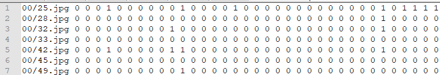
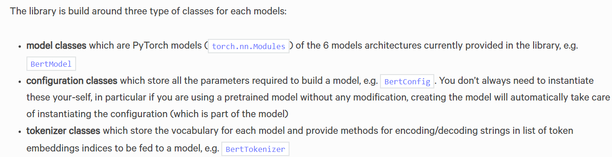
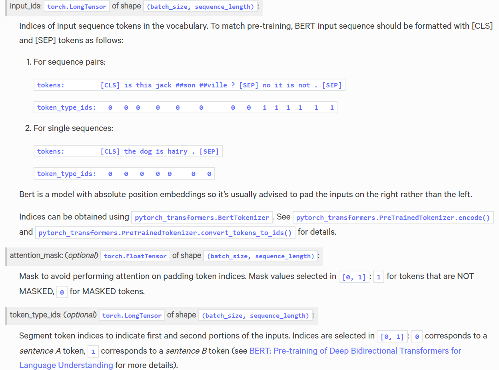
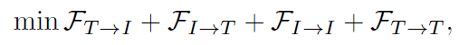
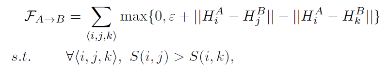

# Cross Modal Retrieval

Pytorch implementation of cross model retrieval on dataset IAPR TC-12.

## Dataset Introduction

IAPR-TC12 dataset:

Images and text are from `iaprtc-12` <https://www.imageclef.org/photodata>
Labels are from `saiaprtc-12` <https://www.imageclef.org/SIAPRdata>

> Includes 20000 image-text pairs, of 255 categories(labels), each text consists of several sentences(in ./annotations).
> In experiments, we change sentences into 2912 dimentional bag-of-words.
>
> nus_*:
>   each line includes image_name + bag_of_words + labels
>   BOWs are 2912 dimentions, and labels are 255 dimentions
>
> nus_retrieval:
>   18000 lines
> nus_train:
>   10000 lines (choose randomly)
> nus_test:
>   2000 lines (choose randomly)
>
> e.g.    iapr_train：
>
> 


## Network Structure

The network mainly consists of three part: imageNet, textNet and troplet loss function. Suppose the length of hashbit is 32.

- ImageNet is a pretrained resnet-18 and it is fine-tuned during network training. 512-dim Image features are extracted by inputting raw pixels of images into imageNet. Finally with a fully connected layer, we will get a 32-dim hash feature.
- TextNet is a pretrained Bert model. Similar to the imageNet part, annotation of an image,which is actually a sentence, is inputted into the textNet and a text feature is extracted. With a following fully connected layer, we will finally get a 32-dim hash feature also.
- Cross-modal loss fucntion of this network is cross-modal retrieval loss, which will be discussed in the following section.


Jointly train imageNet and textNet 

```python
optimizer = optim.Adam(list(imageNet.parameters())+list(textExtractor.parameters())+list(textHashNet.parameters()), lr=args.lr, weight_decay=args.weight_decay)
```

```python
#training step
optimizer.zero_grad()
loss.backward()
optimizer.step()
```

Or train imageNet and textNet with respective optimizer and lr

```python
optimizer_image = optim.Adam(imageNet.parameters(), lr=args.image_lr, 	                weight_decay=args.weight_decay)
optimizer_text = optim.Adam(list(textExtractor.parameters())+
  list(textHashNet.parameters()), lr=args.text_lr,weight_decay=args.weight_decay)
```
```python
#training step
optimizer_image.zero_grad()
loss.backward(retain_graph=True) 
optimizer_image.step()

optimizer_text.zero_grad()
loss.backward()
optimizer_text.step()
```

The above two methods have simliar effect, so why not train together?


## Text Feature Extracter: Bert

Use Bert as text feature extracter with the help of [pytorch_transformers](<https://huggingface.co/pytorch-transformers/quickstart.html#>) .

>  github page <https://github.com/huggingface/pytorch-transformers>



[Bert参数详解](<https://huggingface.co/pytorch-transformers/model_doc/bert.html>)




## Cross-modal Retrieval Loss

The aim of the cross-modal loss function is to keep the similarities between images and texts. The inter-modal ranking loss and the intra-modal ranking loss are used to preserve the similarities. That is, the
hash codes from different modalities should preserve the semantic similarities, and the hash codes from the same modality should also preserve the semantic similarities. Hence, the cross-modal retrieval loss can be formulated as



where the first two terms are used to preserve the semantic similarities between different modalities, and the last two terms are used to preserve the similarities in their own modality. The symbol A → B denotes the A modality is taken as the query to retrieve the relevant data of the B modality, where A ∈ {T, I} and
B ∈ {T, I}. FA→B is the loss function for the A modality as the query and B modality as the database, which is defined as



The objective is the triplet ranking loss, which shows effectiveness in the retrieval problem.


## Experiment

### Prerequisites

In order to run this code you will need to install:

1. Python 3.6
2. PyTorch 1.1.0
3. pytorch-transformers


### Result

Common parameters：

| lr   | batch size | optimizer | num_epochs |
| ---- | ---------- | --------- | ---------- |
| 1e-5 | 32         | Adam      | 300        |

#### IAPR-TC12

| binary bits | margin | I2T  mAP | T2I  mAP |
| ----------- | ------ | -------- | -------- |
| 16          |        |          |          |
| 32          | 12     | 0.5986   | 0.6035   |
| 64          |        |          |          |


## Reference

[1] Xi Zhang, Hanjiang Lai, Jiashi Feng [*Attention-aware Deep Adversarial Hashing for Cross-Modal Retrieval*](http://openaccess.thecvf.com/content_ECCV_2018/papers/Xi_Zhang_Attention-aware_Deep_Adversarial_ECCV_2018_paper.pdf)